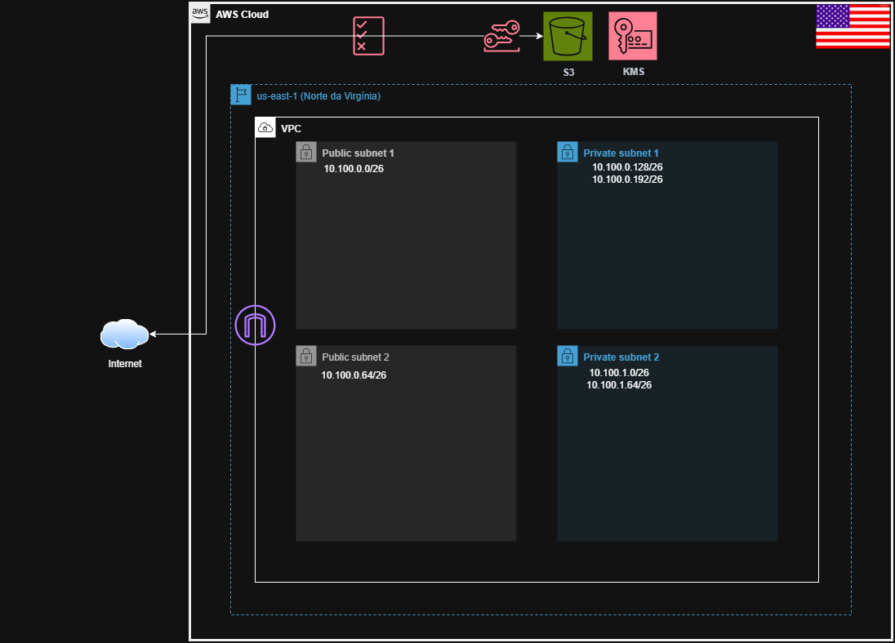

# S3-simples
<!-- BEGIN_TF_DOCS -->

## Diagram

## Requirements

| Name | Version |
|------|---------|
|  [terraform](#requirement\_terraform) | >=1.11.0 |
|  [aws](#requirement\_aws) | >=5.97.0 |

## Providers

| Name | Version |
|------|---------|
|  [aws](#provider\_aws) | 6.11.0 |

## Modules

No modules.

## Resources

| Name | Type |
|------|------|
| [aws_s3_bucket.s3-teste-dev-tf-2025](https://registry.terraform.io/providers/hashicorp/aws/latest/docs/resources/s3_bucket) | resource |
| [aws_s3_bucket_policy.bucket_policy](https://registry.terraform.io/providers/hashicorp/aws/latest/docs/resources/s3_bucket_policy) | resource |
| [aws_s3_bucket_public_access_block.bucket_access_block](https://registry.terraform.io/providers/hashicorp/aws/latest/docs/resources/s3_bucket_public_access_block) | resource |
| [aws_s3_bucket_server_side_encryption_configuration.bucket_encryption](https://registry.terraform.io/providers/hashicorp/aws/latest/docs/resources/s3_bucket_server_side_encryption_configuration) | resource |
| [aws_s3_bucket_versioning.bucket_versioning](https://registry.terraform.io/providers/hashicorp/aws/latest/docs/resources/s3_bucket_versioning) | resource |
| [aws_caller_identity.current](https://registry.terraform.io/providers/hashicorp/aws/latest/docs/data-sources/caller_identity) | data source |

## Inputs

No inputs.

## Outputs

| Name | Description |
|------|-------------|
|  [aws\_s3\_bucket](#output\_aws\_s3\_bucket) | n/a |
|  [aws\_s3\_bucket\_arn](#output\_aws\_s3\_bucket\_arn) | n/a |
<!-- END_TF_DOCS -->